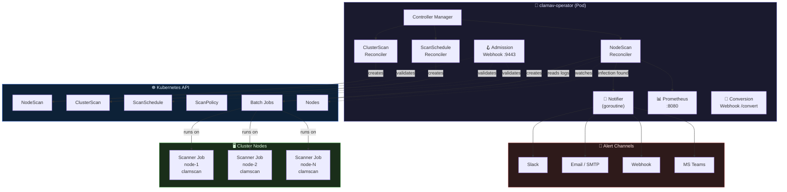
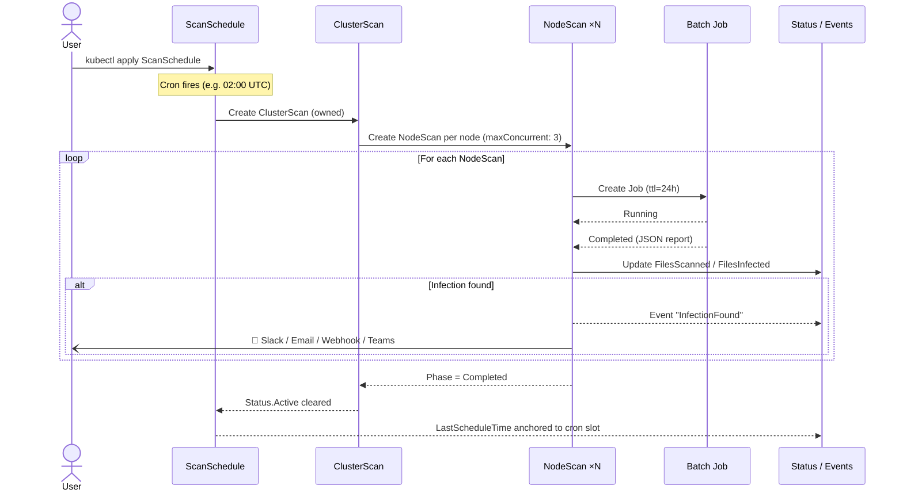
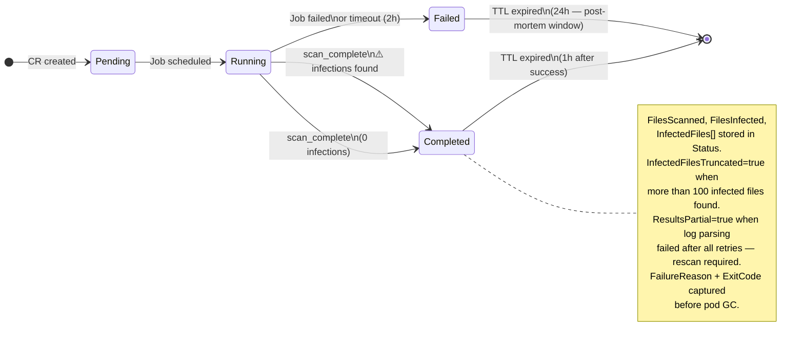
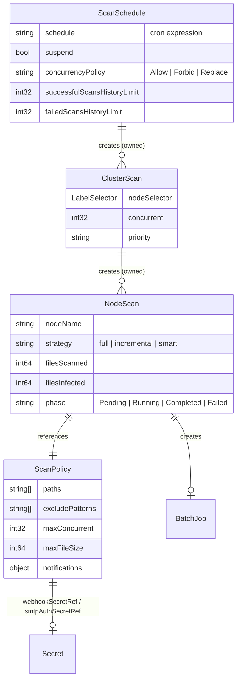
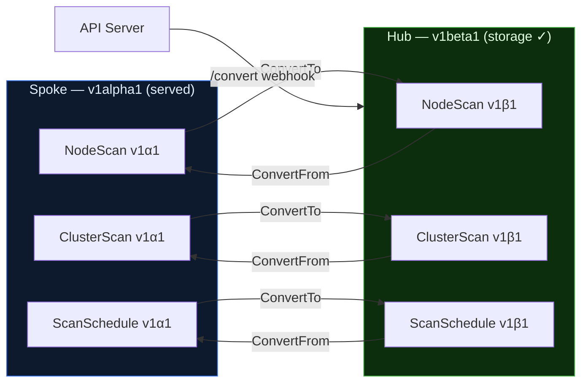
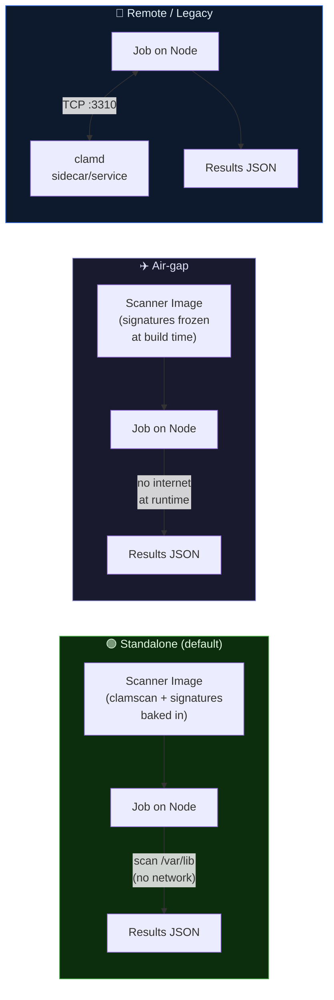
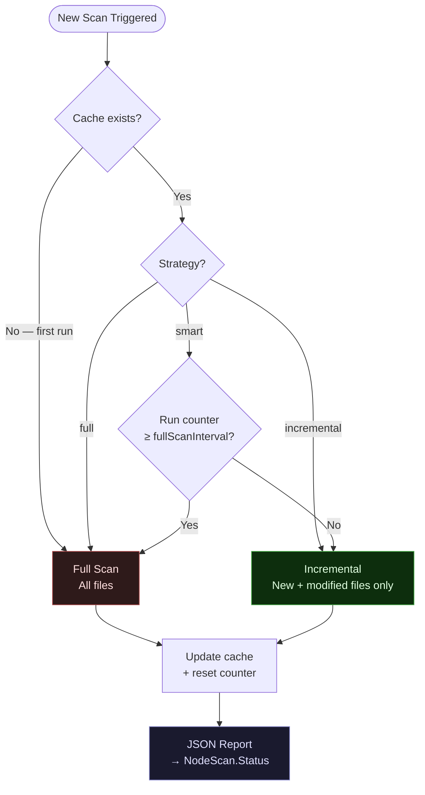
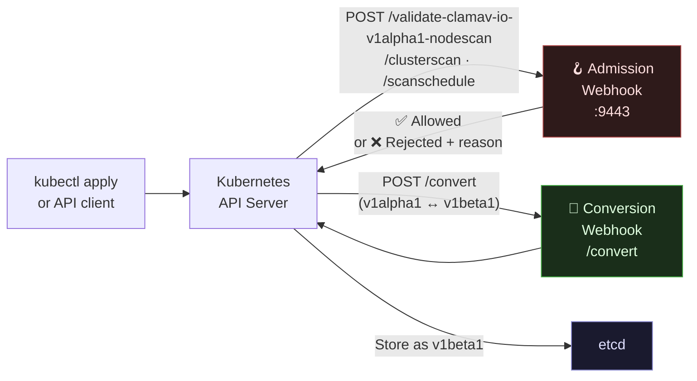
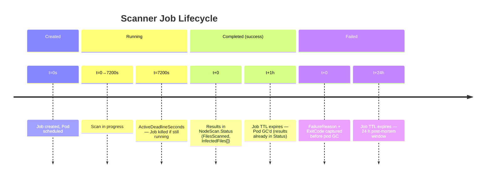
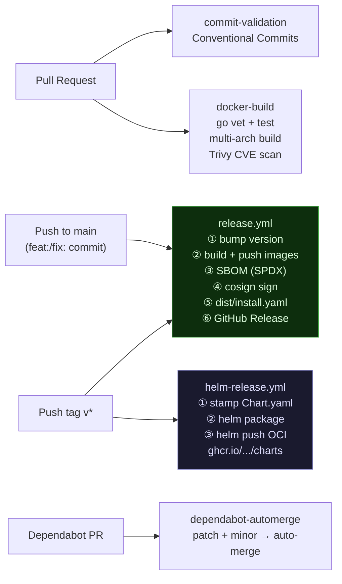

<div align="center">
  
  <br/><br/>

  [](https://github.com/SolucTeam/clamav-operator/actions/workflows/docker-build.yml)
  [](https://github.com/SolucTeam/clamav-operator/releases)
  [](https://github.com/SolucTeam/clamav-operator/blob/main/LICENSE)
  [](https://go.dev)
  [](https://kubernetes.io)
  [](https://helm.sh)
  [](https://github.com/SolucTeam/clamav-operator/releases)
  [](https://github.com/SolucTeam/clamav-operator/releases)

  <br/>

  > **Kubernetes-native antivirus operator** — automated ClamAV scanning across every node in your cluster, with zero external dependencies.

  <br/>

  [Features](#-features) · [Architecture](#-architecture) · [Quick Start](#-quick-start) · [CRDs](#-custom-resources) · [Scanner Modes](#-scanner-modes) · [Monitoring](#-monitoring) · [Development](#-development)
</div>

---

## ✨ Features

<table>
<tr>
  <td>🛡️ <b>Standalone mode</b></td>
  <td><code>clamscan</code> + signatures embedded in the scanner image — no central ClamAV service, no single point of failure</td>
</tr>
<tr>
  <td>🔄 <b>Incremental scanning</b></td>
  <td>Smart strategy: scan only new/modified files, alternate with periodic full scans — up to 10× faster</td>
</tr>
<tr>
  <td>✈️ <b>Air-gap support</b></td>
  <td>Signatures baked into the image at build time — no outbound internet at runtime</td>
</tr>
<tr>
  <td>📅 <b>Cron scheduling</b></td>
  <td>Drift-free cluster-wide scans via <code>ScanSchedule</code> — anchored to the cron grid, not to <code>time.Now()</code></td>
</tr>
<tr>
  <td>📊 <b>Prometheus metrics</b></td>
  <td><code>clamav_files_infected_total</code>, <code>clamav_scan_duration_seconds</code>, running scan gauge, and more</td>
</tr>
<tr>
  <td>🔔 <b>Notifications</b></td>
  <td>Slack, Email (SMTP/TLS), generic Webhook, Microsoft Teams — fire-and-forget, never block a scan</td>
</tr>
<tr>
  <td>🏗️ <b>Multi-arch images</b></td>
  <td><code>linux/amd64</code> and <code>linux/arm64</code> — built, scanned (Trivy) and cosign-signed on every release</td>
</tr>
<tr>
  <td>🔒 <b>Supply-chain security</b></td>
  <td>SBOM (SPDX), cosign image signing, Trivy CVE scanning in CI</td>
</tr>
<tr>
  <td>📦 <b>GitOps-ready</b></td>
  <td><code>observedGeneration</code> in Status — ArgoCD and Flux know exactly when reconciliation is done</td>
</tr>
<tr>
  <td>🪝 <b>Admission webhooks</b></td>
  <td>Invalid CRs (bad cron, negative limits, empty nodeName) are rejected at create/update time</td>
</tr>
<tr>
  <td>🔐 <b>cert-manager TLS</b></td>
  <td>Webhook certificates fully managed by the Helm chart — self-signed CA chain + leaf cert via cert-manager, or auto-generated for dev</td>
</tr>
<tr>
  <td>🐳 <b>Private registry support</b></td>
  <td><code>scanner.imagePullSecrets</code> is now forwarded into every scanner Job pod — works with any private registry</td>
</tr>
</table>

---

## 🏛️ Architecture

### Operator Overview



### Scan Lifecycle (Sequence)



### NodeScan State Machine



### CRD Relationships



### API Conversion (v1alpha1 ↔ v1beta1)



---

## 🚀 Quick Start

### Install with Helm (OCI)

```bash
helm install clamav-operator \
  oci://ghcr.io/solucteam/charts/clamav-operator \
  -n clamav-operator-system --create-namespace
```

### Install with kubectl (single manifest)

```bash
kubectl apply -f https://github.com/SolucTeam/clamav-operator/releases/latest/download/install.yaml
```

### Scan a single node

```yaml
# nodescan.yaml
apiVersion: clamav.io/v1alpha1
kind: NodeScan
metadata:
  name: scan-worker-01
  namespace: clamav-operator-system
spec:
  nodeName: worker-01
  priority: medium
  strategy: full
```

```bash
kubectl apply -f nodescan.yaml
kubectl get nodescan scan-worker-01 -w
# NAME            NODE        PHASE       INFECTED   SCANNED   AGE
# scan-worker-01  worker-01   Running     -          -         0s
# scan-worker-01  worker-01   Completed   0          142847    4m12s
```

### Schedule nightly cluster-wide scans

```yaml
# nightly-schedule.yaml
apiVersion: clamav.io/v1alpha1
kind: ScanSchedule
metadata:
  name: nightly
  namespace: clamav-operator-system
spec:
  schedule: "0 2 * * *"          # Every night at 02:00 UTC
  concurrencyPolicy: Forbid
  successfulScansHistoryLimit: 5
  clusterScan:
    concurrent: 5
    priority: low
    nodeSelector:
      matchLabels:
        kubernetes.io/os: linux
```

> **Drift-free scheduling** — if the operator was down and missed several cron slots, it catches up to the most recent missed slot and anchors `LastScheduleTime` to that cron slot (not `time.Now()`). Schedule drift never accumulates.

---

## 📋 Custom Resources

| CRD | Scope | Purpose |
|-----|-------|---------|
| `NodeScan` | Namespaced | Scan a specific node, once |
| `ClusterScan` | Namespaced | Fan-out scans across all matching nodes |
| `ScanPolicy` | Namespaced | Reusable config: paths, resources, notifications |
| `ScanSchedule` | Namespaced | Cron-triggered recurring `ClusterScan` |
| `ScanCacheResource` | Namespaced | Per-node incremental scan cache (chunked ConfigMaps) |

### ScanPolicy — full example

```yaml
apiVersion: clamav.io/v1alpha1
kind: ScanPolicy
metadata:
  name: production-policy
  namespace: clamav-operator-system
spec:
  paths:
    - /var/lib
    - /opt/app
  excludePatterns:
    - ".*\\.log$"
    - ".*/tmp/.*"
  maxConcurrent: 5
  fileTimeout: 30000            # 30 s per file
  maxFileSize: 104857600        # 100 MB
  resources:
    requests: { cpu: 200m, memory: 256Mi }
    limits:   { cpu: 1000m, memory: 2Gi }

  notifications:
    slack:
      enabled: true
      channel: "#security-alerts"
      webhookSecretRef: { name: slack-webhook, key: url }
      onlyOnInfection: true
    email:
      enabled: true
      smtpServer: "smtp.example.com:465"
      from: "clamav@example.com"
      recipients: ["security@example.com"]
      smtpAuthSecretRef: { name: smtp-creds }
    webhook:
      url: "https://hooks.example.com/clamav"
      headers: { Authorization: "Bearer my-token" }
      onlyOnInfection: false
    teams:
      enabled: true
      webhookSecretRef: { name: teams-webhook-secret, key: url }
      onlyOnInfection: true
```

---

## 🔬 Scanner Modes

### Mode comparison



### Standalone (Default)

Each scanner Job carries its own `clamscan` binary and virus signature database. Scans run **locally on each node** with zero network dependency. No central ClamAV service = no single point of failure.

```yaml
# values.yaml
scanner:
  mode: standalone
  freshclam:
    enabled: true
    schedule: "0 */6 * * *"     # Refresh signatures every 6 h
```

### Air-Gap

Signatures are frozen into the image at build time. Nothing is downloaded at runtime.

```bash
make docker-build-scanner-airgap   # DOWNLOAD_SIGS=false
```

```yaml
scanner:
  mode: standalone
  freshclam:
    enabled: false               # Signatures pre-baked — no internet needed
  image:
    repository: my-registry.internal/clamav-node-scanner
    tag: latest-airgap
```

### Remote / Legacy

Connect to an existing `clamd` deployment you already manage.

```yaml
scanner:
  mode: remote
  clamav:
    host: clamav.clamav.svc.cluster.local
    port: 3310
  signatures:
    persistent: true             # Mount a PVC for the signature DB
```

---

## ⚡ Incremental Scanning



| Strategy | When to use |
|----------|-------------|
| `full` | Always scan everything — maximum coverage |
| `incremental` | Only new/modified files — fastest, best for large nodes |
| `smart` | Auto-alternate: N incremental → 1 forced full — best balance |

```yaml
# ScanPolicy excerpt
spec:
  strategy: smart
  incrementalConfig:
    fullScanInterval: 10       # Full scan every 10 runs
    maxFileAgeHours: 24
    skipUnchangedFiles: true
```

File metadata (mtime, size, hash) is stored in **chunked ConfigMaps** — never in the CRD itself (etcd's 1.5 MB limit is respected at all times).

---

## 📊 Monitoring

```bash
# Live metrics
kubectl port-forward -n clamav-operator-system deployment/clamav-operator 8080:8080
curl -s http://localhost:8080/metrics | grep clamav_
```

### Key Metrics

| Metric | Type | Description |
|--------|------|-------------|
| `clamav_nodescan_running` | Gauge | Active scans in progress |
| `clamav_nodescans_total{status}` | Counter | Total scans by status (Completed / Failed) |
| `clamav_files_scanned_total` | Counter | Cumulative files scanned |
| `clamav_files_infected_total` | Counter | Cumulative infected files found |
| `clamav_scan_duration_seconds` | Histogram | Scan duration distribution |
| `clamav_schedule_executions_total{status}` | Counter | Schedule executions (success / failed) |

### Grafana Dashboard (example queries)

```promql
# Infection rate over 24 h
rate(clamav_files_infected_total[24h])

# Scan failure ratio
rate(clamav_nodescans_total{status="Failed"}[1h])
  / rate(clamav_nodescans_total[1h])

# Average scan duration (p99)
histogram_quantile(0.99, rate(clamav_scan_duration_seconds_bucket[10m]))
```

The Helm chart ships a `PrometheusRule` that fires critical alerts:

```yaml
# Enabled by prometheusRule.enabled: true in values.yaml
- alert: ClamAVScanFailed
  expr: increase(clamav_nodescans_total{status="Failed"}[5m]) > 0
  severity: critical
- alert: ClamAVInfectionDetected
  expr: increase(clamav_files_infected_total[5m]) > 0
  severity: critical
```

---

## 🔒 Security & API Versioning

### Webhook Architecture



**Admission webhook** — rejects invalid CRs at create/update:
- Bad cron expression → immediate error message with the parse failure
- Negative history limits, empty `nodeName`, invalid priority enum
- Applied to `NodeScan`, `ClusterScan`, and `ScanSchedule`

**Conversion webhook** — a single `/convert` handler backed by controller-runtime's scheme dispatch. `v1beta1` is the hub (storage version); `v1alpha1` is the spoke. All three resource types go through it automatically.

**TLS certificate management** — two modes, both fully handled by the Helm chart:

```yaml
# Dev / CI — controller-runtime auto-generates ephemeral self-signed certs
webhook:
  enabled: true
  certManager:
    enabled: false          # auto-generate a self-signed cert (not rotated)

# Production — cert-manager manages the full CA chain
webhook:
  enabled: true
  certManager:
    enabled: true           # creates SelfSigned Issuer → CA Cert → CA Issuer → leaf Cert
                            # cert-manager cainjector injects caBundle automatically
```

When `certManager.enabled: true` the chart creates:
- A `SelfSigned` Issuer (bootstrap only)
- A CA `Certificate` (`isCA: true`, ECDSA P-256, 10-year lifetime)
- A CA `Issuer` backed by the CA cert
- A leaf `Certificate` (1-year, auto-rotated, `rotationPolicy: Always`) whose secret name matches the volume mounted by the operator pod

The `ValidatingWebhookConfiguration` carries a `cert-manager.io/inject-ca-from` annotation so the cainjector populates `caBundle` automatically — no manual patching required.

**CRD conversion webhook** — installed automatically via a Helm post-install/post-upgrade hook Job that patches `nodescans.clamav.io`, `clusterscans.clamav.io`, and `scanschedules.clamav.io` with the correct `conversion.strategy: Webhook` and service reference. Requires `webhook.enabled: true`.

### Job Reliability



---

## ⚙️ Configuration Reference

### Operator Flags

| Flag | Default | Description |
|------|---------|-------------|
| `--scanner-image` | `ghcr.io/solucteam/clamav-node-scanner:latest` | Scanner container image |
| `--webhook-port` | `9443` | Webhook server port — **must match `webhook.port` in values.yaml** |
| `--clamav-host` | `clamav.clamav.svc.cluster.local` | clamd host (remote mode only) |
| `--clamav-port` | `3310` | clamd port (remote mode only) |
| `--skip-startup-checks` | `false` | Disable startup RBAC/ServiceAccount validation |
| `--leader-elect` | `false` | Enable leader election (multi-replica HA) |
| `--metrics-bind-address` | `:8080` | Prometheus metrics endpoint |
| `--health-probe-bind-address` | `:8081` | Liveness/readiness probe endpoint |

> `--webhook-port` is set automatically by the Helm chart from `webhook.port`. If you override `webhook.port` in values, the Deployment args, the Service, and the process all stay in sync.

### Priority-Based Resource Profiles

| Priority | CPU Request | Mem Request | CPU Limit | Mem Limit |
|----------|-------------|-------------|-----------|-----------|
| `high`   | 500m        | 512Mi       | 2000m     | 4Gi       |
| `medium` _(default)_ | 100m | 256Mi  | 1000m     | 2Gi       |
| `low`    | 50m         | 128Mi       | 500m      | 1Gi       |

### RBAC Roles

| Role | Verbs | Use case |
|------|-------|----------|
| `nodescan-editor-role` | get, list, watch, create, update, patch, delete | DevOps managing scans |
| `nodescan-viewer-role` | get, list, watch | Read-only monitoring / audit |
| `clusterscan-editor-role` | … | |
| `clusterscan-viewer-role` | … | |
| `scanpolicy-editor-role` | … | |
| `scanpolicy-viewer-role` | … | |
| `scanschedule-editor-role` | … | |
| `scanschedule-viewer-role` | … | |

---

## 🗂️ Project Structure

```
clamav-operator/
├── api/
│   ├── v1alpha1/                  # CRD types + admission webhooks
│   │   ├── nodescan_types.go
│   │   ├── nodescan_webhook.go
│   │   ├── clusterscan_types.go
│   │   ├── clusterscan_webhook.go
│   │   ├── scanschedule_types.go
│   │   ├── scanschedule_webhook.go  ← cron validated at admission
│   │   ├── scanpolicy_types.go
│   │   ├── incremental_scan_types.go
│   │   ├── conversion.go          ← v1alpha1 ↔ v1beta1 hub/spoke
│   │   └── zz_generated.deepcopy.go
│   └── v1beta1/                   # Storage version (hub)
│       ├── nodescan_types.go
│       ├── clusterscan_types.go
│       ├── scanschedule_types.go
│       └── zz_generated.deepcopy.go
│
├── internal/
│   ├── controller/
│   │   ├── nodescan_controller.go
│   │   ├── clusterscan_controller.go
│   │   ├── scanschedule_controller.go
│   │   ├── incremental_scan_controller.go
│   │   ├── common.go              # requeueWithJitter, shared helpers
│   │   ├── defaults.go            # Resource profiles, constants
│   │   ├── metrics.go
│   │   └── startup_checks.go
│   └── notification/
│       └── notifier.go            # Slack · Email · Webhook · Teams
│
├── cmd/manager/main.go            # Operator entry point
│
├── config/
│   ├── crd/bases/                 # Generated CRD manifests
│   ├── rbac/                      # manager-role + editor/viewer per CRD
│   ├── manager/                   # Deployment, ServiceAccount, Service
│   ├── default/                   # Kustomize root
│   ├── samples/                   # Example CRs
│   └── webhook/
│
├── scanner/                       # Node.js standalone scanner
│   ├── Dockerfile
│   └── src/
│       ├── index.js               # Entry point — writes scan_complete signal
│       ├── scanner.js             # Recursive directory scan
│       ├── incremental.js         # Smart cache logic
│       ├── report.js              # JSON + text report
│       └── __tests__/
│
├── helm/clamav-operator/          # Helm chart (published to GHCR OCI)
├── dist/install.yaml              # Generated by CI: kustomize build
├── build/Dockerfile               # Operator image (Go multi-stage)
└── .github/workflows/
    ├── docker-build.yml           # Multi-arch build + Trivy scan
    ├── release.yml                # Semver + SBOM + cosign + install.yaml
    ├── helm-release.yml           # Publish Helm chart to GHCR OCI
    └── commit-validation.yml      # Conventional Commits check
```

---

## 🛠️ Development

```bash
# Clone & setup
git clone https://github.com/SolucTeam/clamav-operator.git
cd clamav-operator
go mod download

# Generate CRD manifests + DeepCopy
make manifests generate

# Lint (golangci-lint)
make lint

# Unit tests — no cluster needed
make test

# Scanner tests (Node.js)
cd scanner && node --test src/__tests__/

# e2e tests — requires Kind or an existing cluster
make test-e2e
# or against a live cluster:
USE_EXISTING_CLUSTER=true go test ./test/e2e/... -tags=e2e -v -timeout 10m

# Build all images locally
make docker-build-all

# Build air-gap scanner (no internet at runtime)
make docker-build-scanner-airgap

# Generate dist/install.yaml locally
make build-installer
```

### CI / CD Overview



---

## 🔍 Troubleshooting

**Scan job not starting:**
```bash
kubectl logs -n clamav-operator-system deployment/clamav-operator -f
kubectl get events -n clamav-operator-system --sort-by='.lastTimestamp'
```

**Failure reason without a running pod:**
```bash
# Captured in Status before pod GC — always available
kubectl get nodescan scan-worker-01 \
  -o jsonpath='Reason: {.status.failureReason}{"\n"}ExitCode: {.status.exitCode}{"\n"}'
```

**Scan completed but results may be incomplete:**
```bash
# Check for partial results (log parsing failed after all retries)
kubectl get nodescan scan-worker-01 -o jsonpath='{.status.resultsPartial}'
# If "true" → rescan required. Do NOT treat this node as clean.

# Check if infected file list was truncated (>100 infections found)
kubectl get nodescan scan-worker-01 \
  -o jsonpath='Truncated: {.status.infectedFilesTruncated}{"\n"}Total: {.status.filesInfected}{"\n"}'
# infectedFilesTruncated=true means only the first 100 are in .status.infectedFiles
# The full count is always in .status.filesInfected
```

**No ClamAV signatures (standalone):**
```bash
kubectl logs -n clamav-operator-system -l clamav.io/nodescan=<scan-name>
# Look for: "clamscan: command not found" or "No database files found"
# Fix: ensure the scanner image was built with DOWNLOAD_SIGS=true
```

**Remote mode — clamd unreachable:**
```bash
kubectl run test --rm -it --image=busybox -- \
  nc -zv clamav.clamav.svc.cluster.local 3310
```

**Permission denied:**
```bash
kubectl auth can-i create jobs \
  --as=system:serviceaccount:clamav-operator-system:clamav-operator \
  -n clamav-operator-system
```

**Invalid ScanSchedule rejected at admission:**
```bash
# The webhook validates the cron expression at create/update time
kubectl apply -f bad-schedule.yaml
# Error: admission webhook "vscanschedule.kb.io" denied the request:
#   spec.schedule: Invalid value: "every day": invalid cron expression: ...
```

**Webhook TLS issues:**
```bash
# Check the cert-manager Certificate is Ready
kubectl get certificate -n clamav-operator-system
# NAME                                    READY   SECRET                                         AGE
# clamav-operator-webhook-cert            True    clamav-operator-webhook-server-cert            5m

# Verify caBundle is populated (cert-manager cainjector does this automatically)
kubectl get validatingwebhookconfiguration \
  clamav-operator-validating-webhook-configuration \
  -o jsonpath='{.webhooks[0].clientConfig.caBundle}' | wc -c
# Should be > 0. If 0, check that the cainjector is running:
kubectl get pods -n cert-manager -l app=cainjector

# CRD conversion hook — verify it ran successfully
kubectl get job -n clamav-operator-system | grep crd-patcher
# If failed, re-run manually:
helm upgrade --install clamav-operator ./helm/clamav-operator --reuse-values
```

**Scanner image in private registry:**
```bash
# Create the pull secret first
kubectl create secret docker-registry regcred \
  --docker-server=my-registry.internal \
  --docker-username=... --docker-password=... \
  -n clamav-operator-system

# Then install/upgrade with the secret name
helm upgrade --install clamav-operator ./helm/clamav-operator \
  --set "scanner.imagePullSecrets[0].name=regcred"
```

---

## 📄 License

Copyright 2025 The ClamAV Operator Authors.
Licensed under the [Apache License, Version 2.0](LICENSE).

---

## 🤝 Contributing

1. Fork the repository
2. Create your feature branch: `git checkout -b feat/my-feature`
3. Commit using [Conventional Commits](https://www.conventionalcommits.org): `feat: add X` · `fix: resolve Y`
4. Push and open a Pull Request

Issues and discussions → [github.com/SolucTeam/clamav-operator](https://github.com/SolucTeam/clamav-operator/issues)
